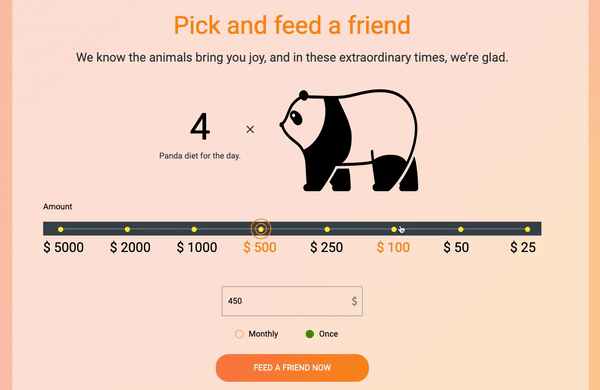
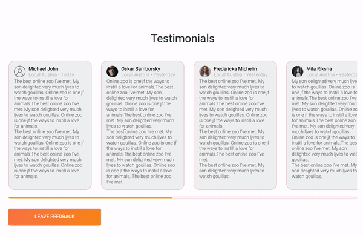

<h1 align="center"> 
  <a href="https://gusap9.github.io/online-zoo/pages/main/" target="_blank"> Online-zoo </a>
  <a href="https://gusap9.github.io/online-zoo/pages/main/">  </img></a>
</h1>

## About 
The site is builded as model for online-zoo.

## Peculiarities
Important points of this app:
- "about" and "donate" tabs are available.
- animations for selecting donation amount. &#8595;&#8595;&#8595;

 </img>
- animations for feedback section. &#8595;&#8595;&#8595;

 </img>

## Usage
To see the project you can directly visit:

<a href="https://gusap9.github.io/online-zoo/pages/main/" target="_blank"><code style="margin-left:40px">https://gusap9.github.io/online-zoo/pages/main//</code></a>

